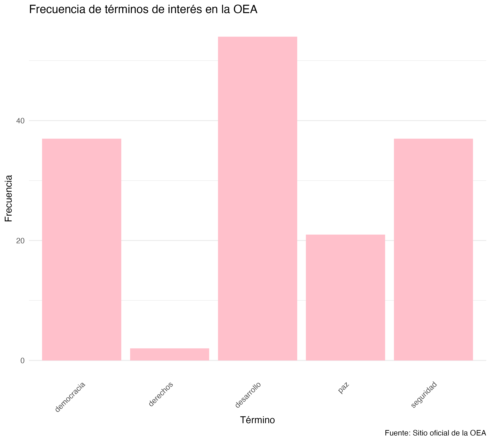

# **INTRODUCCION:** 

El objetivo de este trabajo es analizar los comunicados de prensa de la OEA correspondientes a los meses de enero, febrero, marzo y abril del año 2026. Para esto, utilizo herramientas de web scraping y lematizacion.

# PREGUNTA DE INVESTIGACION: 

¿Cuáles son los principales temas en los comunicados de prensa de la OEA entre enero y abril de 2026?

# ESTRUCTURA DEL PROYECTO: 

**`scraping_oea.R`**: realiza el web scraping de los comunicados desde el sitio oficial de la OEA. Este script genera una base de datos en formato tabular con tres variables: *id*, *título* y *cuerpo*, y guarda tanto los archivos HTML como un archivo `.rds` en la carpeta `/data`.

**`processing.R`**: se encarga del procesamiento del texto. En esta etapa se limpian los textos (eliminando puntuación, números y caracteres especiales), se realiza la lematización y se remueven las stopwords. El resultado se guarda en la carpeta `/output` como un archivo `.rds`.

**`metrics_figures.R`**: construye una matriz de frecuencia de términos (DTM) a partir del corpus procesado. Luego, selecciona términos relevantes y genera una visualización de sus frecuencias, guardada como `frecuencia_terminos.png` en la carpeta `/output`.

Esta estructura permite separar claramente las etapas del análisis, facilitando su replicabilidad y mantenimiento.

------------------------------------------------------------------------

## METODOLOGIA: 

El análisis se desarrolló en tres etapas principales:

1.  **Recolección de datos** Se obtuvieron los comunicados de prensa desde el sitio oficial de la OEA, respetando las restricciones establecidas en el archivo robots.txt, incluyendo los tiempos de espera necesarios.

2.  **Procesamiento del lenguaje natural** Se realizaron las siguientes operaciones:

    -   limpieza del texto (eliminación de caracteres no relevantes)
    -   lematización
    -   conversión a minúsculas
    -   eliminación de stopwords

3.  **Análisis de frecuencia** A partir de la matriz de términos, se seleccionaron cinco palabras relevantes en función del contexto institucional de la OEA: **democracia, elecciones, derecho, multilateralismo y seguridad**.

------------------------------------------------------------------------

## RESULTADOS: 

A continuación se presenta la frecuencia total de los términos seleccionados en el conjunto de comunicados analizados:

```{r}

```

------------------------------------------------------------------------

## INTERPRETACION: 

Los resultados muestran diferencias claras en la frecuencia de los términos seleccionados. En particular, *democracia* y *seguridad* presentan niveles relativamente altos de aparición, lo que sugiere que estos temas ocupan un lugar central en el discurso institucional de la OEA.

La relevancia del término *democracia* es consistente con el rol histórico del organismo como promotor de valores democráticos en la región, especialmente en contextos de crisis políticas o procesos electorales. En esta misma línea, la presencia del término *elecciones* refuerza la importancia de los procesos electorales como componente clave de la agenda del organismo.

Por otro lado, el término *seguridad* indica una preocupación por la estabilidad regional, posiblemente vinculada a problemáticas como el crimen organizado, conflictos internos o desafíos a la gobernabilidad.

El término *multilateralismo* resulta particularmente relevante desde una perspectiva de relaciones internacionales, ya que refleja la naturaleza cooperativa del organismo y su rol como espacio de articulación entre Estados. Su presencia sugiere un énfasis en la coordinación regional y en la resolución conjunta de problemas.

Finalmente, el término *derecho* (posiblemente asociado a derechos humanos o Estado de derecho) refuerza la dimensión normativa del accionar de la OEA, destacando su papel en la promoción de estándares jurídicos y principios institucionales.

En conjunto, estos resultados indican que el discurso de la OEA se organiza en torno a tres grandes ejes: **democracia, seguridad y cooperación multilateral**, lo que refleja su función como actor clave en la gobernanza regional.

------------------------------------------------------------------------

## CONCLUSION: 

El análisis permitió identificar patrones en el discurso institucional de la OEA mediante el uso de herramientas de scraping y procesamiento de lenguaje natural.

La combinación de técnicas computacionales con análisis sustantivo permite estudiar de manera sistemática grandes volúmenes de texto, aportando evidencia empírica sobre las prioridades y el posicionamiento de organizaciones internacionales.

Este enfoque resulta particularmente útil para el análisis en Relaciones Internacionales, ya que permite complementar perspectivas teóricas con evidencia basada en datos.
